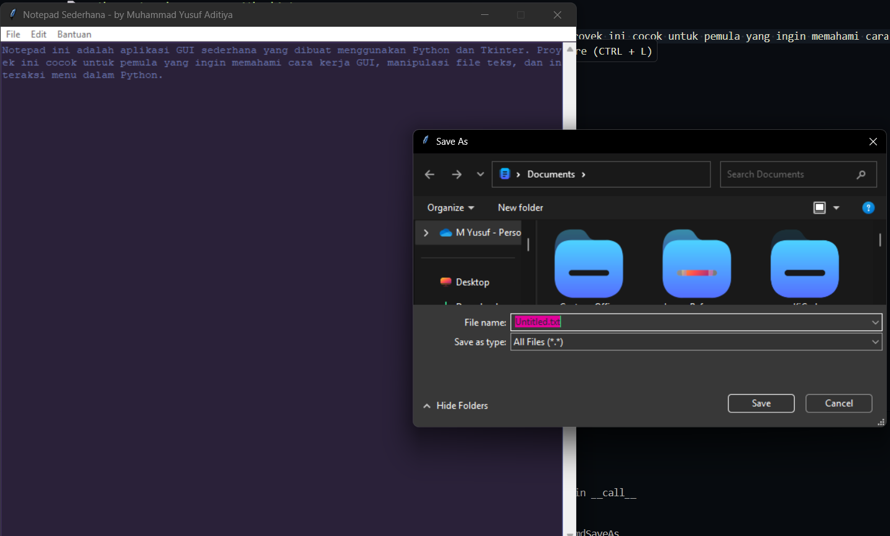

# 📝 Python Notepad - GUI App with Tkinter

Notepad is a simple GUI application built using Python and Tkinter. This project is suitable for beginners who want to understand GUIs, text file manipulation, and menu interaction in Python.

---


## 📌 Key Features

- 🔹 Open `.txt` files
- 🔹 Save and Save As
- 🔹 Cut, Copy, Paste, Delete
- 🔹 Search and Highlight Words
- 🔹 Display Date & Time
- 🔹 Application Information
- 🔹 `ScrolledText` component for text areas

---

## 🚀 How to Run

1. Make sure Python is installed on your system (Python 3.8+ recommended).
2. Clone or download this repository.
3. Run the following command:
```bash
python notepad.py

## 🧠 Libraries Used

- `tkinter` – A standard GUI for creating desktop-based Python applications.
- `tkinter.scrolledtext` – An add-on module for `tkinter` for text areas with automatic scrollbars.
- `datetime` – Used to get and display the current time and date.
- `tkinter.filedialog` – To open and save files through a dialog window.
- `tkinter.messagebox` – To display popup messages such as k

---

## 👨‍💻 Created by

**Muhammad Yusuf Aditiya**
🎓 Student & Developer
💼 [LinkedIn](https://linkedin.com/in/myfza) | 🌐 [Portfolio](https://vizart.netlify.app)
✉️ Email: vizart.id@email.com
